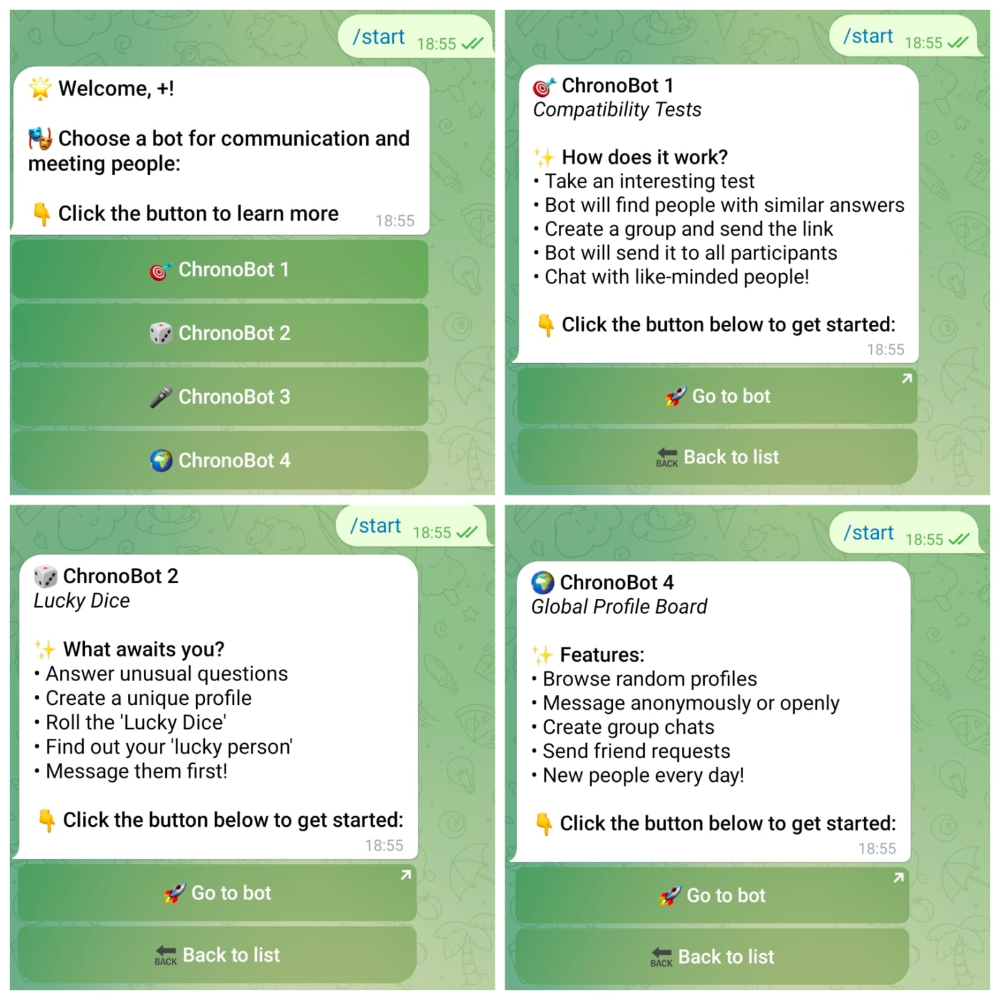

# ChronoRoom — Bot Launcher

A central Telegram bot that provides access to the ChronoRoom bot ecosystem through a single interface.

## 📸 Demo



## ✨ Features

- 🎯 Centralized ChronoRoom menu
- 🤖 Access to four independent Telegram bots
- 📋 Information about each bot
- 🔗 Direct links to the selected bot
- 🔐 Telegram channel subscription check
- 📱 Inline Telegram interface

## 🤖 Available Bots

### ChronoBot 1

Compatibility tests and matchmaking based on user answers.

### ChronoBot 2

Profile creation, questionnaires, and random profile discovery.

### ChronoBot 3

Random voice conversations, voice effects, and a mini-game.

### ChronoBot 4

Profile discovery, anonymous communication, and group invitations.

## 🔄 How It Works

1. The user starts the launcher.
2. The bot checks the user's access.
3. The ChronoRoom menu is displayed.
4. The user selects one of the four bots.
5. Information about the selected bot is displayed.
6. The user can open the selected bot directly.

## 🧩 Project Structure

```text
ChronoRoom-Bot5/
├── README.md
├── screenshots/
│   └── demo.jpg
└── bot.py
